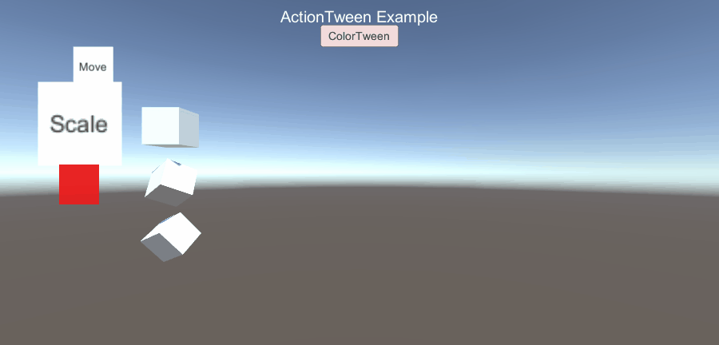

#ActionTween

## Summary
- Unity plugin for action tween.

## Demo
- Demos in the path "Assets/Example/Scenes/SampleScene" provide reference to you.

## Merit
- ActionTween reference DoTween , but better performance
- Currently, it has only partial functions, but it can be easily extended,you just inherit `ActionTween` like:
```Java
  public class MoveAction : ActionTween
```

## Preview
###### Base Action
- MoveAction
- RotationAction
- ScaleAction
- ColorAction
- FadeAction
- SequenceAction

##### Advanced Action
- En.. await



## Callback

```Java
#region 回调函数
/// <summary>
/// 动画开始时Callback
/// </summary>
public ActionTweenCallback mOnBeginPlay;
/// <summary>
/// 动画完成时Callback
/// </summary>
public ActionTweenCallback mOnComplete;
/// <summary>
/// 动画每帧Callback
/// </summary>
public ActionTweenCallback mOnStepUpdate;
/// <summary>
/// 当loop次数>1时，每次循环完回调，最后一次循环完，不回调
/// </summary>
public ActionTweenCallback mOnLoopComplete;
/// <summary>
/// 被Kill时，回调
/// </summary>
public ActionTweenCallback mOnKill;

#endregion
```

## Action Controller

- Each action is controlled in the following ways

```Java

public interface IActionTween
{
    void Play(bool autoActive = true);

    void RePlay(bool autoActive = true);

    void Revert(bool autoActive = true);

    void Pause();

    void Resume();

    void Reset();

    void Kill();

}

```
## Extensions

- Action extensions functional interface in `IExtensionsAction.cs`

## Usage
#### MoveAction
```Java
var mTestActionTween = this.transform.MoveTween(mTargetTran, mDuration);
mTestActionTween
    .SetEase(mEaseType)
    .SetActionDirectionType(mDirectionType)
    .SetActionScaleTime(mScaleTime)
    .SetActionType(mActionType)
    .SetAnimCurve(m_AnimCurve)
    .SetLoopTime(mLoopTime)
    .SetSpeedAble(m_UseSpeed)
    .SetSpeed(m_Speed)
    .SetRelative(m_Relative)
    .SetBeginPlayCallback(() =>
    {
        mTempTime = Time.realtimeSinceStartup;
        LOG.Log(this.gameObject.name + " anim Begin ");
    })
    .SetCompleteCallback(() =>
    {
        mActionExTime = Time.realtimeSinceStartup - mTempTime;
        LOG.Log(this.gameObject.name + " anim Complete ");
    })
    .SetAutoKill(mAutoKill)
    .SetKillCallback(() =>
    {
        LOG.Log(this.gameObject.name + " anim Kill Self ");
    })
    .SetLoopCompleteCallback(() =>
    {
       // mTestActionTween.Kill(); //your can kill action in callback
       // mTestActionTween.ReCalDuration(mTestActionTween.mSpeed += m_AddSpeed);
       // LOG.Log("loop complete once");
    })
    .SetAutoPlay(m_AutoPlay);
```

#### SequenceAction
```Java

  var m_SeqAction = new SequenceAction();
  ActionTween mRotActionTween = this.transform.RotationTween(m_RotToValue, mDuration, m_RotModle);
  mRotActionTween
      .SetEase(mEaseType)
      .SetActionDirectionType(mDirectionType)
      .SetActionScaleTime(mScaleTime)
      .SetActionType(mActionType)
      .SetLoopTime(mLoopTime)
      .SetSpeedAble(m_UseSpeed)
      .SetSpeed(m_Speed)
      .SetRelative(m_Relative)
      .SetAutoKill(mAutoKill)
      .SetKillCallback(()=>
      {
          LOG.Log("mRotActionTween Kill");
      })
      .SetCompleteCallback(()=>
      {
         // LOG.Log("mRotActionTween Finish");
      });

  var moveAction = this.transform.MoveTween(mTargetTran, mDuration);
  moveAction
      .SetEase(mEaseType)
      .SetActionDirectionType(mDirectionType)
      .SetActionScaleTime(mScaleTime)
      .SetActionType(mActionType)
      .SetLoopTime(0)
      .SetSpeedAble(m_UseSpeed)
      .SetSpeed(m_Speed)
      .SetRelative(m_Relative)
      .SetAutoKill(mAutoKill);

  var colorAction = this.transform.ColorTween(Color.blue,mDuration);
  colorAction.SetActionType(mActionType);

  m_SeqAction.Add(0, mRotActionTween);
  m_SeqAction.Add(2, moveAction);
  m_SeqAction.Append(colorAction);
  m_SeqAction
     // .SetActionType(mActionType) //SequenceAction need not set ActionType
      .SetAutoKill(mAutoKill)
      .SetStepUpdateCallback(()=>
      {
          mActionCurTime = Time.realtimeSinceStartup - mTempTime;
      })
      .SetBeginPlayCallback(() =>
      {
          mTempTime = Time.realtimeSinceStartup;
         // LOG.Log(this.gameObject.name + " anim Begin m_SeqAction");
      })
      .SetCompleteCallback(() =>
      {
          mActionExTime = Time.realtimeSinceStartup - mTempTime;
          //LOG.Log(this.gameObject.name + " anim Complete m_SeqAction");
      })
      .SetKillCallback(()=>
      {
         LOG.Log(this.gameObject.name + " anim Kill m_SeqAction");
      });
  m_SeqAction.SetAutoPlay(m_AutoPlay);

```


#### `Note`
* When use ActionTween , **using SmileGame;** in the head .
* SequenceAction need not set `ActionType` but it also Revert Play Action
* call backs : `OnBeginPlay` ,`OnComplete` , `OnStepUpdate` ,`OnLoopComplete`,`OnKill`
* SequenceAction `Add` at action time , `Append` is end of action
* When `SetSpeedAble` is true ,`durationTime` is calculated according to `speed`
* When `SetEase` is `EaseEnum.INTERNAL_Custom` will use `CustomAnimCurve` through `SetAnimCurve` .

## Contact
- If you have any questions, feel free to contact me at chuanshaooye@qq.com.
